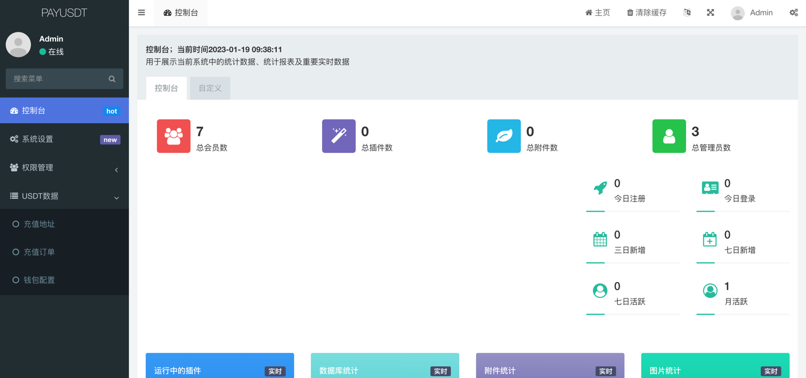
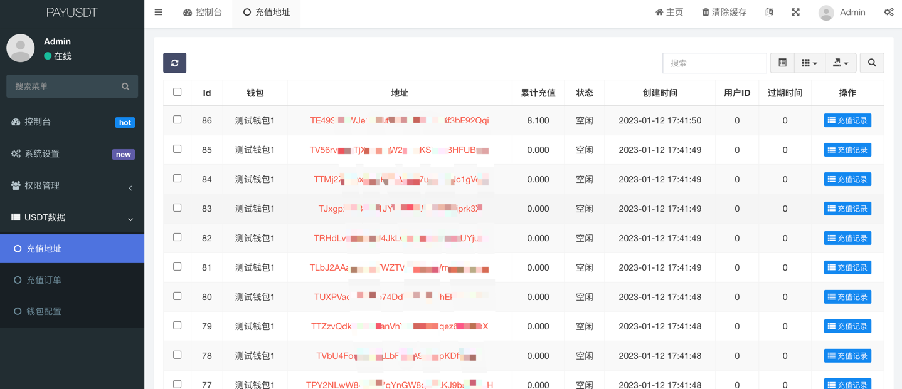
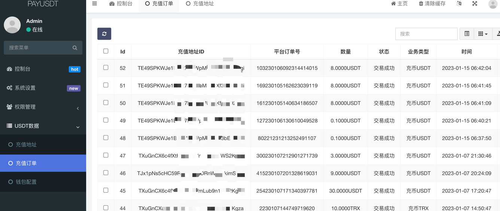
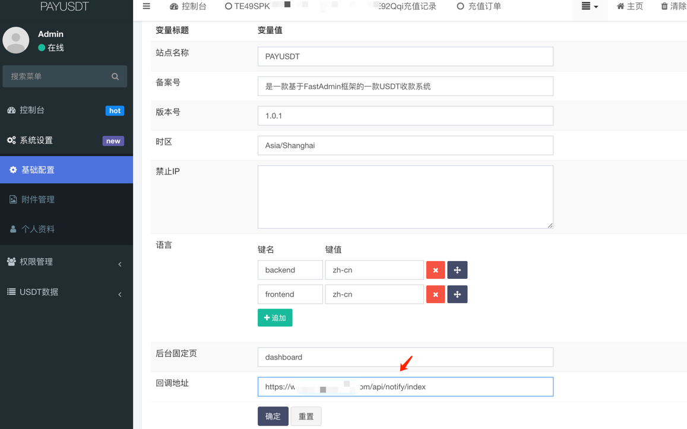

PAYUSDT是一款基于FastAdmin框架的一款USDT收款系统，PHP+USDT支付系统！

## 啰嗦一下PAYUSDT
PAYUSDT不是开源学习的demo，目前已有十多个大项目在使用中。因为项目经常需要使用USDT充值功能，然而市面上很多开源的usdt支付系统，比如epusdt、TokenPay...懂技术的人都懂，这些能用，但是不人性化，必须输入充值金额，这很让人难受，明明是去中心化交易...如果客户不按规定充值呢？很多客户都是不看题目的，那怎么办了？
最后我们团队着手开发这个项目PAYUSDT，PAYUSDT是目前市面上来讲（不敢说唯一，低调）能实现自由金额充值、多币种、TRC、ERC都支持的插件了吧。

## 主要特性
* 1.不限充值金额，任意充值、精准回调，没有误差!!!
* 2.可介入任意app、网站等项目；
* 3.支持TRC-20、ERC-20协议；
* 4.支持多币种充值、不仅仅限于USDT的检测；
* 5.去中心化链上交易、我们无法控制，放心使用！
* 6.支持自动提币！

## 思路简述
用主地址生成很多子地址；然后分配子地址去充值；最后将子地址的币种归集到主地址；
- 备注：交易手续费是链上的矿工费

## 界面截图

## 搭建PAYUSDT
按照fastadmin框架搭建流程搭建起来即可，so easy!

## 接口
PAYUSDT [接口文档](./api/Api.md)

## 软件定制
在使用中有任何问题，请使用以下联系方式联系我

技术TG：@dapp1222
技术TG链接: https://t.me/dapp1222

## 特别鸣谢

感谢以下的项目,排名不分先后

ThinkPHP：http://www.thinkphp.cn

fastadmin：https://www.fastadmin.net/

Bootstrap：http://getbootstrap.com

